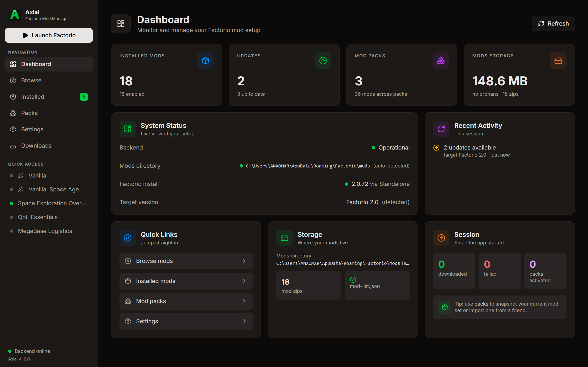
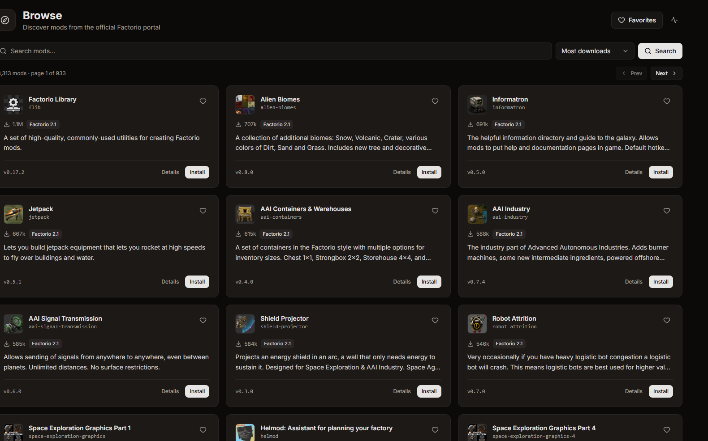
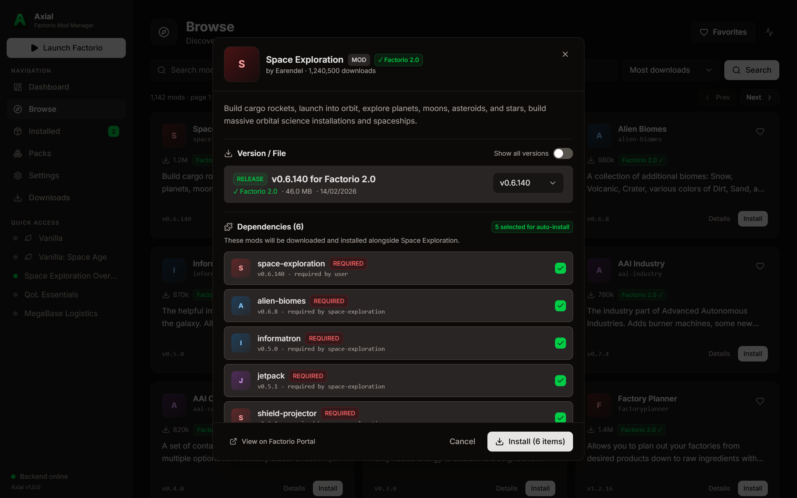

<div align="center">


# Axial

### A fast, modern desktop mod manager for Factorio

[](https://github.com/TheDragonSoft/Axial-Mod-Manager/releases/latest)
[](https://factorio.com)
[](https://github.com/TheDragonSoft/Axial-Mod-Manager/releases/latest)
[](LICENSE)
[](https://tauri.app)
[](https://www.rust-lang.org)

<p align="center">
  <a href="#-quick-download"><strong>Download</strong></a> •
  <a href="#-interface-showcase"><strong>Screenshots</strong></a> •
  <a href="#-key-features"><strong>Features</strong></a> •
  <a href="#-installation--first-launch"><strong>First Launch Guide</strong></a> •
  <a href="#-development"><strong>Development</strong></a> •
  <a href="#-architecture"><strong>Architecture</strong></a>
</p>

</div>

---

**Axial** is an open-source, high-performance desktop mod manager for [Factorio](https://www.factorio.com/), fully supporting **Factorio 2.0 (Space Age)** and **Factorio 1.1**. Built on **Tauri 2** with a native **Rust** backend and a responsive **React 19** frontend, Axial offers instant startup, sub-second scanning of hundreds of mods, and deep dependency graph resolution.

Browse thousands of mods, inspect full dependency trees before downloading, switch between isolated mod packs in one click, and launch Factorio directly—all from an interface crafted in warm stone and status-green hues.

---

<p align="center">
  
</p>

---

## ⚡ Quick Download

Download the latest version (**v1.0.0 — Conveyor**) for your operating system:

| Operating System | Package | Link | Details |
| :--- | :--- | :--- | :--- |
| **Windows** | NSIS Installer (x64) | [**Download .exe**](https://github.com/TheDragonSoft/Axial-Mod-Manager/releases/download/v1.0.0/Axial_1.0.0_x64-setup.exe) | Standard installer with desktop & start menu shortcuts |
| **Windows** | WiX MSI Package (x64) | [**Download .msi**](https://github.com/TheDragonSoft/Axial-Mod-Manager/releases/download/v1.0.0/Axial_1.0.0_x64_en-US.msi) | Windows Installer package for managed environments |
| **macOS** | Apple Silicon DMG | [**Download .dmg**](https://github.com/TheDragonSoft/Axial-Mod-Manager/releases/download/v1.0.0/Axial_1.0.0_aarch64.dmg) | Native Apple Silicon (M1/M2/M3/M4) drag-and-drop disk image |
| **Linux** | Standalone AppImage | [**Download .AppImage**](https://github.com/TheDragonSoft/Axial-Mod-Manager/releases/download/v1.0.0/Axial_1.0.0_amd64.AppImage) | Universal Linux binary (`chmod +x` and run) |
| **Linux** | Debian / Ubuntu Package | [**Download .deb**](https://github.com/TheDragonSoft/Axial-Mod-Manager/releases/download/v1.0.0/Axial_1.0.0_amd64.deb) | Install via `sudo dpkg -i` or software center |

> 📦 For cryptographic signatures (`.sig`), updater manifests (`latest.json`), and release notes, visit the [**GitHub Releases**](https://github.com/TheDragonSoft/Axial-Mod-Manager/releases) page.

---

## 📸 Interface Showcase

### 1. Centralized Command Dashboard
The dashboard provides a real-time health check of your Factorio environment. Monitor enabled mods, pending updates, active mod packs, disk storage consumption, auto-detected game installations, and recent session activities at a single glance.

<p align="center">
  
</p>

---

### 2. Discover & Search the Official Mod Portal
Search the official Factorio mod portal with instant query filtering, category selectors, sorting options, and live community ratings. Bookmark your favorite mods and view lazily loaded mod summaries and community thumbnail tiles.

<p align="center">
  
</p>

---

### 3. Reviewable Dependency Trees & Safe Installs
Never guess what an install will do to your existing setup. Axial recursively evaluates every Factorio dependency operator (`?` optional, `!` conflict, `~` hidden-required, `+` recommended) and generates a structured, multi-tier **Install Plan** before anything is downloaded or written to disk.
- **Categorized tiers**: Review mods to be installed, satisfied dependencies, optional recommendations, and potential incompatibilities.
- **SHA1 hash verification**: Every downloaded archive is verified against the official portal-published SHA1 checksum before reaching your `mods/` directory.

<p align="center">
  
</p>


## ✨ Key Features

- 🏎️ **Blazing Fast Performance** — Cold-scans 500+ installed mod archives in under 200ms using streaming zip header inspections and cached disk fingerprints. Zero database bloat; ~50MB idle RAM usage.
- 🛡️ **Cryptographic Download Integrity** — Every mod download is matched against the portal-published SHA1 checksum before entering your `mods/` directory. Broken or mismatched downloads are immediately rejected.
- 🚀 **One-Click Game Launch** — Launch Factorio directly from the sidebar. Executable path is resolved automatically across Steam, GOG, and standalone installs without manual configuration.
- 🧩 **Factorio 2.0 & Space Age Ready** — Seamless support for Factorio 2.0 and the Space Age expansion DLC. Target version compatibility is automatically detected from game files.
- 📦 **Mod Packs & Instant Switching** — Group mods into isolated profiles. Activate a pack with a single toggle: Axial diffs the target state against installed zips, downloads missing mods, and applies `mod-list.json`. Includes built-in **Vanilla** and **Vanilla (Space Age)** modes.
- 📋 **Base64 Pack Sharing** — Share modpacks with friends or server members using a compact Base64 code string—no file transfers or proprietary formats required.
- ⚠️ **Reverse Dependency Guard** — When uninstalling a mod, Axial alerts you if other installed mods rely on it, preventing broken game saves.
- 🔄 **Safe Updates & Version Switching** — Check installed mods against newer releases compatible with your detected Factorio version. Switch versions easily with full changelog previews.
- 🧹 **Storage Hygiene & Orphan Cleanup** — Detect unreferenced zips, old versions, and `.part` download remnants, with safe one-click cleanup.
- 👁️ **External Change Watcher** — Changes made directly to `mod-list.json` or new zips dropped into your mods directory by Factorio are reflected in Axial immediately without manual reloading.
- ⌨️ **Command Palette (Ctrl+K)** — Keyboard-first navigation for switching views, searching mods, launching the game, or toggling packs.

---

## 🛠️ Tech Stack

| Component | Technology | Description |
| :--- | :--- | :--- |
| **Runtime** | [Tauri 2](https://tauri.app/) | Secure, lightweight native desktop shell with zero electron bloat |
| **Backend** | [Rust](https://www.rust-lang.org/) | Async services with Tokio, Reqwest, Serde, Zip, and Tracing |
| **Frontend** | [React 19](https://react.dev/) + [TypeScript](https://www.typescriptlang.org/) | Fast, typed modern web interface bundled with Vite 8 |
| **Styling** | [Tailwind CSS 4](https://tailwindcss.com/) | Custom design system using warm stone scale with green status accents |
| **State** | [Zustand 5](https://github.com/pmndrs/zustand) | Lightweight, predictable reactive state management |
| **CI / CD** | GitHub Actions | Automated tests on push/PR; multi-platform release builds on `v*` tags |

---

## 🚀 Installation & First Launch

Download the installer or package for your operating system from the [Latest Release](https://github.com/TheDragonSoft/Axial-Mod-Manager/releases/latest).

Because Axial is an independent open-source project distributed directly without commercial certificate authorities, your operating system may display a security prompt on first launch:

<details>
<summary><strong>🪟 Windows (Defender SmartScreen)</strong></summary>

1. Run the installer (`Axial_<version>_x64-setup.exe` or `.msi`).
2. If Windows Defender SmartScreen shows *"Windows protected your PC"*, click **More info**.
3. Click **Run anyway** to proceed with installation.
</details>

<details>
<summary><strong>🍎 macOS (Gatekeeper)</strong></summary>

1. Download the `.dmg` (`aarch64` for Apple Silicon), open it, and drag `Axial.app` into `/Applications`.
2. On first launch, macOS Gatekeeper may report that Apple cannot check the app for malicious software.
3. **To open:** Right-click (or Control-click) `Axial.app` in `/Applications`, select **Open**, and click **Open** in the dialog.  
   *(Alternatively, run `xattr -cr /Applications/Axial.app` in Terminal).*
4. Once authorized, macOS remembers your choice and opens normally on subsequent launches.
</details>

<details>
<summary><strong>🐧 Linux (AppImage & Debian)</strong></summary>

**Standalone AppImage:**
```bash
chmod +x Axial_<version>_amd64.AppImage
./Axial_<version>_amd64.AppImage
```

**Debian / Ubuntu (.deb):**
```bash
sudo dpkg -i Axial_<version>_amd64.deb
```
</details>

*(For details on code signing and project status, see [docs/signing.md](docs/signing.md)).*

---

## 💻 Development

### Prerequisites
- [pnpm](https://pnpm.io/) 9+
- [Rust](https://www.rust-lang.org/) (stable)
- [Tauri 2 Prerequisites](https://tauri.app/start/prerequisites/) for your operating system

### Setup & Running
```bash
# Clone the repository
git clone https://github.com/TheDragonSoft/Axial-Mod-Manager.git
cd Axial-Mod-Manager

# Install dependencies
pnpm install

# Run Vite frontend + Rust backend in development mode
pnpm tauri dev
```

### Useful Commands
```bash
pnpm dev                                        # Frontend only (Vite dev server)
pnpm build                                      # TypeScript type-check + Vite production build
cargo test --manifest-path src-tauri/Cargo.toml # Run backend test suite (125+ unit tests)
pnpm tauri build                                # Build release bundle for your platform
```

---

## 📂 Architecture & Project Layout

```
src/                       React frontend
  pages/                   DashboardPage, BrowsePage, InstalledPage, PacksPage, SettingsPage
  components/              ModCard, InstallModal, VersionsModal, QueueDrawer, Sidebar, etc.
  components/ui/           Shared design system primitives (Button, Modal, Toggle, Badge, etc.)
  lib/api.ts               Typed invoke() wrappers — frontend half of the IPC contract
  lib/events.ts            Global backend event listeners (state synchronization)
  store/                   Zustand stores (UI state, download queue, thumbnails, summaries)
src-tauri/                 Rust backend
  src/commands/            Thin Tauri IPC command handlers
  src/core/services/       Core application services:
    ├── portal_client.rs   Official mod portal API integration
    ├── index_client.rs    Caching layer & request rate limiting
    ├── downloader.rs      Download queue with SHA1 validation & backoff retries
    ├── deps.rs            Factorio dependency expression parser & version math
    ├── resolver.rs        BFS dependency graph planner & conflict resolver
    ├── mod_store.rs       Mods directory scanner & mod-list.json atomic writes
    ├── game_detect.rs     Factorio installation and version detection
    ├── launcher.rs        Detached game process spawning
    ├── packs.rs           Profile manifests & target-state reconciliation
    └── updates.rs         Release comparison & update detection
  src/models.rs            Wire types (camelCase serde) — single source of truth for IPC
  src/config.rs            settings.json persistence with atomic temp-rename writes
```

---

## 📁 Data & Log Paths

Axial stores its configuration, profiles, and logs in standard operating system app-data directories under `com.thedragonsoft.axial`:

| OS | Configuration & Log Location |
| :--- | :--- |
| **Windows** | `%APPDATA%\com.thedragonsoft.axial\` |
| **macOS** | `~/Library/Application Support/com.thedragonsoft.axial/` |
| **Linux** | `~/.config/com.thedragonsoft.axial/` |

- `settings.json` — Application preferences, detected game directories, and active pack state.
- `profiles/` — Stored modpack manifests.
- `logs/axial.log` — Rolling application logs (automatically rotated at 5 MB).

---

## ℹ️ A Note on Downloads & Integrity

Mod metadata and search indices are retrieved directly from the official [Factorio Mod Portal API](https://mods.factorio.com/api) (read-only, no user login required). 

Mod archives (`.zip`) are downloaded via the community mirror (`mods-storage.re146.dev`) because official direct downloads require portal user credentials. To guarantee security and prevent tampering, **Axial computes a streaming SHA1 checksum of every downloaded archive** and matches it against the official SHA1 published by the Factorio portal API before touching your mods folder. If a checksum fails, the download is permanently rejected and removed.

In-app auto-updates for Axial are cryptographically signed with Axial's Minisign release key.

---

## 📄 License

Axial is licensed under the [MIT License](LICENSE).

